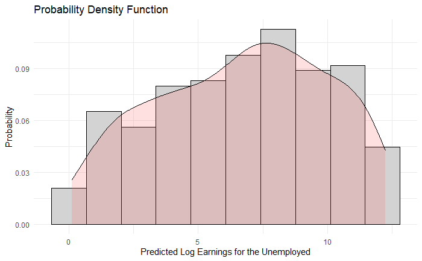

```{r setup, include=FALSE}
knitr::opts_chunk$set(echo = TRUE)


# Packages required for subsequent analysis. P_load ensures these will be installed and loaded. 
if (!require("pacman")) install.packages("pacman")
pacman::p_load(ggplot2, 
               stargazer, 
               sampleSelection,
               lmtest,
               AER,
               tidyverse)

# load dataset
dfEarnings <- read.csv("Data/logEarnings.csv")

# set seed to reproduce analysis
set.seed(123)

```

# Exercise 1

## A 


```{r include=FALSE, eval=FALSE, echo=FALSE, results='hide'}

## Part A: Create a simple model with wages as dependent, schooling, age and age squared as independent
model1 = lm(logWage ~ schooling + age + age2, data = dfEarnings)
summary(model1)
stargazer(model1)


```

We specify the model as follows:

\begin{align*}
  Log(Earnings) = \beta_0 + Schooling \beta_1 + Age \beta_2 + Age^2 \beta_3
\end{align*}

We run an OLS regression with this model, the results of which can be found below. The only statistically significant variable (5\% threshold) is the measure for schooling. On average, an increase of one year of schooling leads to an 22% increase in earnings. 

\begin{table}[!htbp] \centering 
  \caption{The effect of Schooling, Age and $Age^2$ on earnings} 
  \label{} 
\begin{tabular}{@{\extracolsep{5pt}}lc} 
\\[-1.8ex]\hline 
\hline \\[-1.8ex] 
 & \multicolumn{1}{c}{\textit{Dependent variable:}} \\ 
\cline{2-2} 
\\[-1.8ex] & Log of Wage \\ 
\hline \\[-1.8ex] 
 Schooling & 0.22$^{***}$ \\ 
  & (0.03) \\ 
  & \\ 
 Age & $-$0.34 \\ 
  & (0.52) \\ 
  & \\ 
 Age$^2$ & $-$0.01 \\ 
  & (0.01) \\ 
  & \\ 
 Intercept & 26.41$^{***}$ \\ 
  & (8.06) \\ 
  & \\ 
\hline \\[-1.8ex] 
Observations & 416 \\ 
R$^{2}$ & 0.82 \\ 
F Statistic & 604.261$^{***}$ (df = 3; 412) \\ 
\hline 
\hline \\[-1.8ex] 
\textit{Note:}  & \multicolumn{1}{r}{$^{*}$p$<$0.1; $^{**}$p$<$0.05; $^{***}$p$<$0.01} \\ 
\end{tabular} 
\end{table} 

## B
The problem is an selection on unobservables and observables. We have a selected sample, excluding the unemployed. This means we have no information on their potential earnings, if they were employed. We cannot just extrapolate our findings for the employed to the non-employed, since the selection influences both unobservable variables (for example; the unemployed might have less motivation) and observable variables (for instance; the effect of years of schooling on earnings might be less strong for people who have not worked for some years).  We model this selection bias in two steps. First, we indicate if the dependent variable is observed as follows:

\begin{align*}
I^*_i = Z'_i\gamma + V_i
\end{align*}

The indicator variable $I_i$ takes value 1 if $I^*_i > 0$, and 0 if $I^*_i \leq 0$. Second, we define our latent variable $Y^*_i$. 

\begin{align*}
Y^*_i = X'_i\beta + U_i
\end{align*}

We use these two definitions to define our observed dependent variable, $Y_i$.

\begin{align*}
Y_i =  \begin{cases}  Y^*_i  & \text{for } I_i = 1 \\
                      Missing & \text{for } I_i = 0 \end{cases}
\end{align*}

If we try to estimate $Y_i$ with OLS, it will be consistent under one of two conditions. First, if $U_i$ and $V_i$ are independent. The intuition is that in this case, there is random sampling, which means the sample is not biased. But this is not the case here, since the observations are unobserved based on a criterion (unemployment). Second, if $X_i$ and $Z_i$ are uncorrelated. The intuition here is that when this holds, the variables that determine if one falls outside of the selected sample ($Z_i$) are unrelated to the the independent variables used in the selected sample ($X_i$), and thus the zero mean condition ($E(U_i | X_i) = 0$) still holds. But this is again, highly questionable here - for example, a low level of schooling makes it more likely someone becomes unemployed, and negatively affects their earnings. If neither of these two conditions hold, which appears to be the case here,  the OLS is inconsistent.

## C

```{r include=FALSE, eval=FALSE, echo=FALSE, results='hide'}


# create indicator variable for unemployed
dfEarnings$unemployed = ifelse(is.na(dfEarnings$logWage),0,1)


# check correlation matrix with logged wages
cor_matrix_wages <- cor(na.omit(dfEarnings) %>% select(-unemployed))

# check correlation matrix with unemployment (Indicator variable)
cor_matrix_unemployed <- cor(dfEarnings %>% select(-logWage))


```


The variable for the exclusion restriction should fulfill two conditions. First, the variable should have explanatory power when determining $I_i$. In this case, the variable should realistically influence the likelihood someone is unemployed. Second, the variable should be unrelated to the dependent variable $Y_i$, in this case earnings. From the variables available, our best candidate appears to be the dummy variable of married (1 if married, 0 if not). Regarding the first condition; When someone is married, this affect their willingness to continue working, since they share income with their partner. Regarding the second condition; if one assumes that wages are reflective of someones productivity, the fact that someone is married, should not meaningfully change one's productivity. However, there are some reasons to believe marriage still impacts wages - for one, married couples are more likely to have a baby, which likely affects ones earnings. But given the available variables, this appears the one that comes closest to fulfilling both criteria. Looking at the correlations, these confirm our intuitions; the correlation between marriage and unemployment is 0.17, but only 0.02 with logged wages. 


##  D
```{r include=FALSE, eval=FALSE, echo=FALSE, results='hide'}

## Part D

### I first do it manually, and then with a package to compare

# custom functionto perform two-step heckman estimation
heckman <- function(formula_selection, formula_outcome, df){
  
  # get the independent variables for selection model
  dfX_selection <- model.matrix(formula_selection, df)

  # step 1 of heckman: use probit to estimate gamma
  heckman_step1 = glm(formula_selection, data = df, family = binomial(link="probit"))

  # use gamma to reconstruct millsratio
  Zgamma = dfX_selection %*% coef(heckman_step1)
  pdfNorm_Zgamma = dnorm(Zgamma, 0,1)
  cdfNorm_zgamma = pnorm(Zgamma, 0,1)
  invMillRatio= pdfNorm_Zgamma/cdfNorm_zgamma

  # define formula and dataframe for second step
  formula_step2 = update(formula_outcome, ~ . + invMillRatio)
  df_step2 = cbind(df, invMillRatio = invMillRatio)

  # step 2 of heckman: add millsratio to regular OLS with selected variables
  heckman_step2 = lm(formula_step2, data=df_step2)
  
  return(heckman_step2)

  
}

# no excluded variable
Result_Heckman_NoExclusion = heckman(unemployed ~ schooling + age + age2, logWage ~ schooling + age + age2, df=dfEarnings)

# with excluded variable in selection formula
Result_Heckman_Exclusion = heckman(unemployed ~ schooling + age + age2 + married, logWage ~ schooling + age + age2, df=dfEarnings)

# combine results in table
stargazer(Result_Heckman_NoExclusion, Result_Heckman_Exclusion)


# using sample selection package for 2-step heckman
heckman_package= heckit(selection = unemployed ~ schooling + age + age2 + married,
                       outcome = logWage ~ schooling + age + age2, 
                       data = dfEarnings,
                       method="2step")
# our estimate is equal to that of the package

## Part E

# using sample selection package for ML estimation - no exclusion
Result_MLE_NoExclusion = heckit(selection = unemployed ~ schooling + age + age2,
                               outcome = logWage ~ schooling + age + age2, 
                               data = dfEarnings,
                               method="ML")

Result_MLE_NoExclusion


# using sample selection package for ML estimation - with exclusion
Result_MLE_Exclusion = heckit(selection = unemployed ~ schooling + age + age2 + married,
                               outcome = logWage ~ schooling + age + age2, 
                               data = dfEarnings,
                               method="ML")


# combine results in table
stargazer(Result_MLE_NoExclusion, Result_MLE_Exclusion)


```

We first estimate without the exclusion restriction, in which $X_i$ = $Z_i$ for the Heckman estimator. Because these terms are equal, there is collinearity in the second step of the Heckman estimator, biasing the estimates. To explain this a bit more formally, consider the two steps in the Heckman estimator:

\begin{align*}
\text{Step 1: Using a probit model, estimate $I_i$ with:  } \hat{I_i} = Z_i'\hat{\gamma_i} + V_i\\
\text{Step 2: Estimate $\beta$ and $\rho\sigma$ with: } Y_i = X_i\beta + \rho\sigma\frac{\phi(Z_i'\hat{\gamma_i})}{\Phi(Z_i'\hat{\gamma_i})} + U_i^*  
\end{align*}


If $X_i$ = $Z_i$, then:

\begin{align*}
\frac{\phi(Z_i'\hat{\gamma_i})}{\Phi(Z_i'\hat{\gamma_i})} = \frac{\phi(X_i'\hat{\gamma})}{\Phi(X_i'\hat{\gamma})} \\
 Y_i = X_i\beta + \rho\sigma\frac{\phi(X_i'\hat{\gamma})}{\Phi(X_i'\hat{\gamma})} + U_i^*
\end{align*}
The latter regression has perfect collinearity. This means the standard errors for our estimators of $\beta$ and $\rho\sigma$ will be inflated. To illustrate this difference, we first conduct the Heckman estimation where $X_i$ = $Z_i$, with $X_i$ consisting of the schooling, age, and age squared variables. We then conduct the Heckman estimation with the married variable added to $Z_i$. The table below reports the results of the second regression in the Heckman estimation:  

\begin{table}[!htbp] \centering 
  \caption{Sample Selection Model, with Heckman estimator} 
  \label{} 
\begin{tabular}{@{\extracolsep{5pt}}lcc} 
\\[-1.8ex]\hline 
\hline \\[-1.8ex] 
 & \multicolumn{2}{c}{\textit{Dependent variable:}} \\ 
\cline{2-3} 
\\[-1.8ex] & \multicolumn{2}{c}{logWage} \\ 
\\[-1.8ex] & Without exclusion restriction & With exlcusion restriction\\ 
\hline \\[-1.8ex] 
 schooling & 0.303 & 0.215$^{***}$ \\ 
  & (0.855) & (0.032) \\ 
  & & \\ 
 age & 1.423 & $-$0.385 \\ 
  & (17.376) & (0.544) \\ 
  & & \\ 
 age2 & $-$0.039 & $-$0.010 \\ 
  & (0.273) & (0.009) \\ 
  & & \\ 
 invMillRatio & 7.341 & $-$0.174 \\ 
  & (72.233) & (0.617) \\ 
  & & \\ 
 Constant & $-$6.436 & 27.209$^{***}$ \\ 
  & (323.291) & (8.553) \\ 
  & & \\ 
\hline \\[-1.8ex] 
Observations & 416 & 416 \\ 
\hline 
\hline \\[-1.8ex] 
\textit{Note:}  & \multicolumn{2}{r}{$^{*}$p$<$0.1; $^{**}$p$<$0.05; $^{***}$p$<$0.01} \\ 
\end{tabular} 
\end{table} 

## E 

When we use the ML estimation, we run into the same problem. When a regression equation has perfect collinearity, many iterative methods that maximize the log-likelihood function (such as Newton-Rapson) are unable to identify the variance of the estimator - leading to undefined standard errors in if we don't apply the exclusion restriction.

\begin{table}[!htbp] \centering 
  \caption{Sample Selection Model, With MLE estimator} 
  \label{} 
\begin{tabular}{@{\extracolsep{5pt}}lcc} 
\\[-1.8ex]\hline 
\hline \\[-1.8ex] 
 & \multicolumn{2}{c}{\textit{Dependent variable:}} \\ 
\cline{2-3} 
\\[-1.8ex] & \multicolumn{2}{c}{logWage} \\ 
\\[-1.8ex] & Without exclusion restriction & With exclusion restriction\\ 
\hline \\[-1.8ex] 
 schooling & 0.274 & 0.215$^{***}$ \\ 
  & (Undefined.) & (0.032) \\ 
  & & \\ 
 age & 1.594 & $-$0.379 \\ 
  & (Undefined.) & (0.538) \\ 
  & & \\ 
 age2 & $-$0.042 & $-$0.011 \\ 
  & (Undefined.) & (0.009) \\ 
  & & \\ 
 Constant & $-$6.423 & 27.091$^{***}$ \\ 
  & (Undefined.) & (8.430) \\ 
  & & \\ 
\hline \\[-1.8ex] 
Observations & 666 & 666 \\ 
\hline 
\hline \\[-1.8ex] 
\textit{Note:}  & \multicolumn{2}{r}{$^{*}$p$<$0.1; $^{**}$p$<$0.05; $^{***}$p$<$0.01} \\ 
\end{tabular} 
\end{table} 

## F

We find the distribution of potential earnings for the non-employed in two steps. First, using the coefficients from the ML estimation of sample selection model (with the exclusion criterion), we predict the earnings of the unemployed. We use the ML estimation, since this is more efficient than the two-step Heckman estimator. Second, we use kernel density estimation (KDE) to estimate the probability density function of these earnings. The plot below shows the result of this method. 


```{r include=FALSE, eval=FALSE, echo=FALSE, results='hide'}

# get the unemployed
dfEarnings_unemployed <- dfEarnings[dfEarnings$unemployed == 0,]

# predict their earnings, given the coefficients from ML estimate (adjusted for truncation)
Predicted_Earnings_Unemployed <- predict(Result_MLE_Exclusion, dfEarnings_unemployed)
dfEarnings_unemployed$Predicted_Earnings = Predicted_Earnings_Unemployed


Unemployed_DensityPlot <- ggplot(data=dfEarnings_unemployed,aes(x=Predicted_Earnings)) + 
                             geom_histogram(aes(y=..density..), bins=10,colour="black", fill="lightgrey")+
                             geom_density(alpha=.2, fill="#FF6666") +
                             labs(x="Predicted Log Earnings for the Unemployed", y="Probability", title="Probability Density Function")+
                             theme_minimal()


Unemployed_DensityPlot

```


{width=65%}

The main downside to this method is that the model we specified for the employed might not be sufficient to capture certain dynamics that that are particularly important for the unemployed. For instance, the model does not capture how long someone has been out of a job (since those employed currently have a job), which might affect the earning potential of those currently unemployed if they were to have a job. 


# Exercise 2

## A 

A key condition for OLS being the best linear unbiased estimator (BLUE) is that the errors are uncorrelated with the independent variables - the so-called exogeneity condition, or more formally, $plim(\frac{1}{n}X_i'\epsilon_i) = 0$. There are several reasons why this might not hold - one is that there is another variable that influences both $X_i$ and $y_i$. In the case of schooling ($X_i$) and earnings ($y_i$), there are several variables that affect both; for instance,  racist sentiments in society both affect people's ability to obtain schooling and find a job, and socio-economic privilege of one's family likely make both schooling and the job search easier. Given this, it seems implausible that this condition of OLS is satisfied.

## B

A good set of instruments should fulfill two criteria: first, it should be relevant, or more formally: $Cov(Z_i,X_i) \neq 0$. Second, it should be valid: $Cov(Z_i, U_i) = 0$. Logically speaking, we suspect the distance variable does not fulfill the second criterion. How close one lives to a school can often be a function of parental wealth (since they can use their wealth to afford more expensive inner city houses closer to schools), which also tends to affect future earnings. On the other hand, regional subsidy policy appears more valid - since not all poor families necessarily get subsidies (they might not live in regions that adopt such policies). 

To check validity of the instruments, we look at the correlation of errors terms from OLS regression and two instruments: distance and regional subsidies. For a joint instrument we use the Sargan test.

To check relevance of the instruments, we use F-test and as a rule of thumb 10. To check whether our regressors are endogenous we conduct the Hausman test. The results are shown below:


```{r include=FALSE, eval=FALSE, echo=FALSE, results='hide'}


# original model
modelSchooling = lm(logWage ~ schooling + age + age2, data = dfEarnings)

# take OLS error terms
residualsOLS <- residuals(modelSchooling)

# correlate error terms with instruments
cor(na.omit(dfEarnings), residualsOLS)

#re-estimate models with the subsidy instrument
modelSchooling_subsidyIV <- ivreg(logWage ~ schooling + age + age2 | subsidy + age + age2, data = dfEarnings)
summary(modelSchooling_subsidyIV, diagnostics=TRUE)

#re-estimate models with the distance instrument
modelSchooling_distanceIV <- ivreg(logWage ~ schooling + age + age2 | distance + age + age2, data = dfEarnings)
summary(modelSchooling_distanceIV, diagnostics=TRUE)

#re-estimate models with the subsidy and distance instrument
modelSchooling_bothIV <- ivreg(logWage ~ schooling + age + age2 | distance + subsidy + age + age2, data = dfEarnings)
summary(modelSchooling_bothIV, diagnostics=TRUE)

# create table 
stargazer(modelSchooling, modelSchooling_subsidyIV, modelSchooling_distanceIV, modelSchooling_bothIV)

```

\begin{table}[!htbp] \centering 
  \caption{} 
  \label{} 
\begin{tabular}{@{\extracolsep{5pt}}lcccc} 
\\[-1.8ex]\hline 
\hline \\[-1.8ex] 
 & \multicolumn{4}{c}{\textit{Dependent variable: logWage}} \\ 
\cline{2-5} 
\\[-1.8ex] & \textit{OLS} & \multicolumn{3}{c}{\textit{instrumental}} \\ 
 & \textit{} & \multicolumn{3}{c}{\textit{variable}} \\ 
\\[-1.8ex] & OLS & Subsidy & Distance & Subsidy and Distance\\ 
\hline \\[-1.8ex] 
 schooling & 0.216$^{***}$ & 0.401$^{***}$ & 0.470 & 0.408$^{***}$ \\ 
  & (0.032) & (0.106) & (0.299) & (0.102) \\ 
  & & & & \\ 
 age & $-$0.342 & $-$0.233 & $-$0.192 & $-$0.229 \\ 
  & (0.521) & (0.546) & (0.587) & (0.547) \\ 
  & & & & \\ 
 age2 & $-$0.011 & $-$0.013 & $-$0.014 & $-$0.013 \\ 
  & (0.008) & (0.009) & (0.010) & (0.009) \\ 
  & & & & \\ 
 Constant & 26.409$^{***}$ & 23.694$^{***}$ & 22.681$^{**}$ & 23.589$^{***}$ \\ 
  & (8.057) & (8.517) & (9.704) & (8.530) \\ 
  & & & & \\ 
\hline \\[-1.8ex] 
Observations & 416 & 416 & 416 & 416 \\ 
Adjusted R$^{2}$ & 0.813 & 0.798 & 0.784 & 0.797 \\ 
Weak instrument & - & 43.320$^{***}$ & 5.374$^{**}$ & 23.894$^{***}$ \\ 
Hausman & - & 3.634$^{**}$ & 0.845 & 4.343$^{***}$ \\
Sargan test & - & - & - & 0.052 \\
\hline 
\hline \\[-1.8ex] 
\textit{Note:}  & \multicolumn{4}{r}{$^{*}$p$<$0.1; $^{**}$p$<$0.05; $^{***}$p$<$0.01} \\ 
\end{tabular} 
\end{table} 

The variables distance and regional subsidy are almost not correlated with OLS error terms (0.045 and 0.089, respectively), i.e. they are valid instruments. Sargan test for a joint relevance of distance and regional subsidy as instruments show that both instruments are valid and the model specification is correct. F-test is bigger than 10 when we use subsidy or subsidy and distance together. Thus, both instruments are relevant.

## C

If all the independent variables are exogenous, then the OLS estimator is the most efficient consistent estimator - the IV estimator will still be consistent, but according to the Gaus-Markov theorem less efficient than OLS. We use the Hausman test to test for the exogeneity of the independent variable (schooling). In the Hausman test with distance and subsidy and only subsidy as the instrument variables, the Hausman test rejects the null hypothesis (exogenous independent variables, OLS is consistent) at a 5\% threshold. This means we should prefer the IV estimator with distance and subsidy or only subsidy as the instrumental variables. However, as a joint instruments doesn't add a lot to the model with only subsidy as an instrument, we should prefer the IV estimator with only subsidy.

